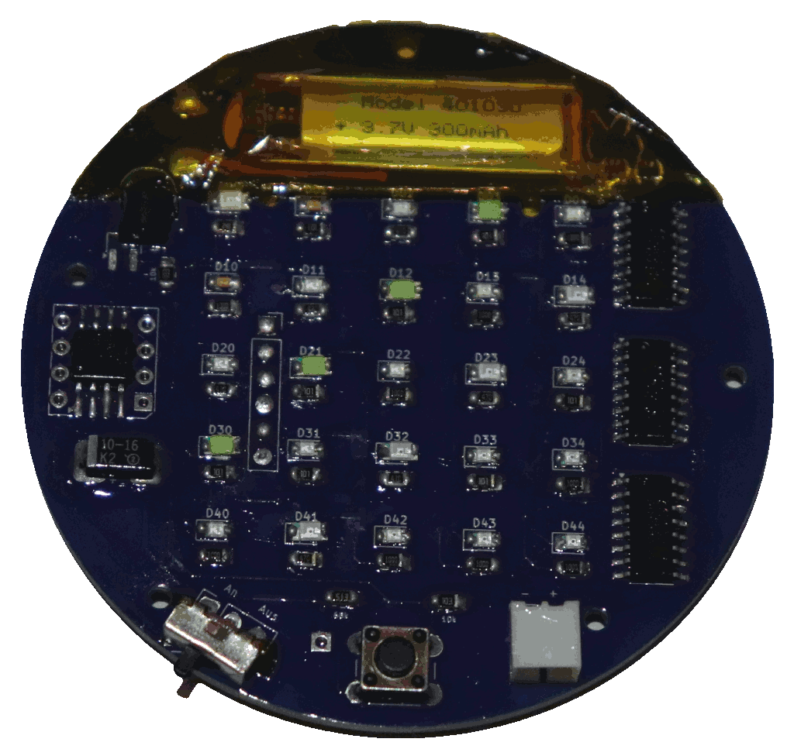
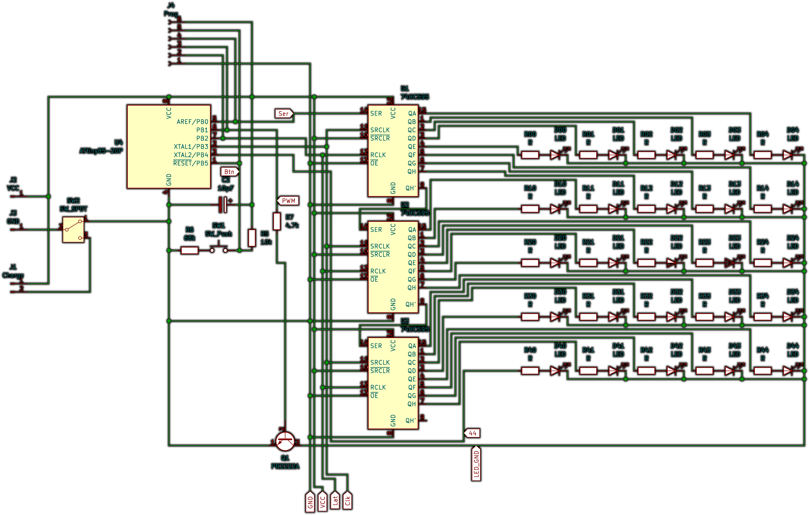

# KidsPatch_ShiftRegisterPWM

Using an ATTiny85 and a 5x5 LED shift register display for a school bag patch

## Story

This is my second project to create a programmable patch for school bags. It is very similar to the [first one](/TheNeoBurn/KidsPatch_WS2812) but instead of a 5x5 WS2812 matrix display, this one uses shift registers and simple LEDs, making this a more low-level approach in hardware and softwere.

This is meant to be more of a playground. It is easier to efficiently implement features and because there is no one-wire timing requirement, this can easily run on lower power-settings and speeds.

## Hardware

Components:

- 1x ATTiny85
- 3x 74HC595 shift register
- 1x PNP transistor (A2222 works fine)
- 1x capasitor (~10µF)
- 1x power switch
- 1x pushbutton
- 25x LED
- 25x resistor (~100Ω)
- 2x resistors (for voltage divider, e.g. 10kΩ and 68kΩ works)
- 1x resistor (~4.7kΩ or even higher to control transistor)
- 1x battery (~300 mAh @ 3.7 V)
- 1x Charging connector
- 1x battery charger

I'm using 3 shift registers with 8 ports each which gives me 24 outputs with a 3-pin control. The 25th LED will be controlled by the Arduino directly. To allow setting the brightness, I'm using a A2222 transistor with an Arduino's PWM pin which will control the brightness of all LEDS at once. And there is a pushbutton as input.

This means that all 6 GPIO pins of the ATTiny85 will be used. That also means that I need to take special care with Pin1 / PB5 which is the Reset pin and will reset the programm if it goes below half the main voltage. I chose to implement the pushbutton there, using a voltage divider so I can read the analog input of either maximum or a bit lower when the botton is pressen. This means though that there is no low-level interrupt for this which makes a sleep-mode impractical. The only option to wake the ATTiny up in this configuration would be to power-cycle it.

I've tested my setup not just with a li-ion battery but also with a 3V CR2032 buttoon battery. This works with red LEDs and a slow ATTiny85 CPU speed (becose of the low voltage) but only lasts for about an hour and that was too much waste for my liking.

I did not plan to make this two PCBs high like the other patch I made so that there is no space for an integrated charging board. I'm not fit enough in these things to implement that directly on my PCB so I outsourced it to a seperate charger with a connector on the PCB.

This is how I use the ATTiny pins:

- `Pin1` / `PB5` / `A0`: Pushbutton (with voltage divider)
- `Pin2` / `PB4`: LED 44 (25th LED)
- `Pin3` / `PB3`: Shift-register clock
- `Pin4` / `GND`: Battery- (behind the power switch)
- `Pin5` / `PB0`: Shift-register serial
- `Pin6` / `PB1`: Transistor PWM
- `Pin7` / `PB2`: Shift-register latch
- `Pin8` / `VCC`: Battery+

Also, I included a connector to easily upload the script on changes:

- `Pin1`: To programmer Arduino ISP `Pin10`
- `Pin4`: To programmer Arduino ISP `GND`
- `Pin5`: To programmer Arduino ISP `Pin11`
- `Pin6`: To programmer Arduino ISP `Pin12`
- `Pin7`: To programmer Arduino ISP `Pin13`
- `Pin8`: To programmer Arduino ISP `VCC` / `5V`

## Code

Features:
- 5x5 pixel character set
- Text scrolling, theoretical animation scrolling
- Play animations (with brightness-values included)
  - Pulsating heart
  - Jumping dots (2 versions)
  - Passing car
  - (others not used)

To relyably catch a button press between frames, I implemented my ohn delay function `delayAni(uint8_t)`.

I didn't bother to implement a sleep-mode.

Characters can be commented out if not used to save dynamic memory.

Animations are stored in program memory so there is a lot of space compared to dynamic memory and the timeing it easily quick enough.

I also created little JavaScript tools to help creating and editing animations:
- Editor: [bjsblog.spdns.de/stuff/BjSMatrixEditor2.htm](https://bjsblog.spdns.de/stuff/BjSMatrixEditor2.htm)
- Rotater: [bjsblog.spdns.de/stuff/BjSMatrixRotater.htm](https://bjsblog.spdns.de/stuff/BjSMatrixRotater.htm)

### IDE / flashing

I use the following Arduino IDE settings:

- Board URL: [drazzy.com/package_drazzy.com_index.json](http://drazzy.com/package_drazzy.com_index.json)
- Additional library: `Adafruit NeoPixel`
- Board: `ATTinyCore`/ `ATTiny25/45/85 (no bootloader)`
  - Chip: ATTiny85
  - Clock source: `1 MHz (internal)`
  - Timer 1 Clock: `CPU (CPU frequency)`
  - LTO: `Enabled`
  - millis()/micros(): `Enabled`
  - Save EEPROM: `EEPROM retained`
  - B.O.D. Level: `B.O.D. Disabled (saves power)`
  - Programmer: `Arduino as ISP`

> **Do not forget to burn the bootloader before flashing the program!**

To flash the ATTiny, prepare an Arduino (Uno or Nano works best for me), connect the Pins 10 to 13 plus VCC and GND to the ATTiny (mapping see Hardware) and use the programmer to upload the script.

